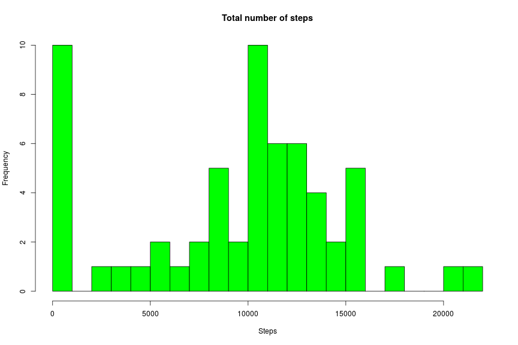
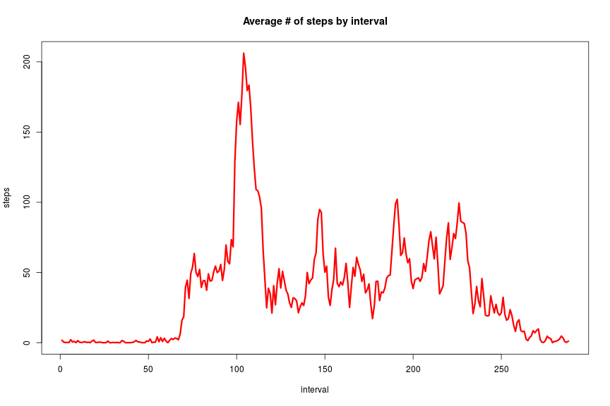
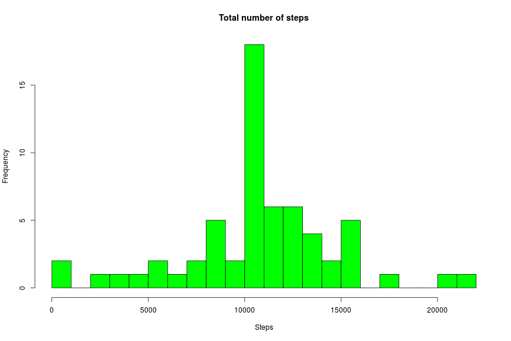
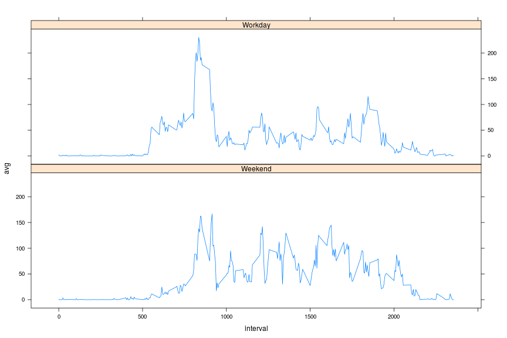

# Introduction

It is now possible to collect a large amount of data about personal movement using activity monitoring devices such as a Fitbit, Nike Fuelband, or Jawbone Up. These type of devices are part of the “quantified self” movement – a group of enthusiasts who take measurements about themselves regularly to improve their health, to find patterns in their behavior, or because they are tech geeks. But these data remain under-utilized both because the raw data are hard to obtain and there is a lack of statistical methods and software for processing and interpreting the data.

The variables included in this dataset are:

- steps: Number of steps taking in a 5-minute interval (missing values are coded as NA)
- date: The date on which the measurement was taken in YYYY-MM-DD format
- interval: Identifier for the 5-minute interval in which measurement was taken

The dataset is stored in a comma-separated-value (CSV) file and there are a total of 17,568 observations in this dataset.

# Loading and preprocessing the data

First, lets load our data

```r
activity = read.csv("activity.csv")
```

and see its summary

```r
str(activity)
```

```
## 'data.frame':	17568 obs. of  3 variables:
##  $ steps   : int  NA NA NA NA NA NA NA NA NA NA ...
##  $ date    : Factor w/ 61 levels "2012-10-01","2012-10-02",..: 1 1 1 1 1 1 1 1 1 1 ...
##  $ interval: int  0 5 10 15 20 25 30 35 40 45 ...
```
We see, that the second column has factor type. That is not what we need, so let's transform its type to date.

```r
activity$date <- as.Date(activity$date)
```
Let's check, that our transformation has effect:

```r
str(activity)
```

```
## 'data.frame':	17568 obs. of  3 variables:
##  $ steps   : int  NA NA NA NA NA NA NA NA NA NA ...
##  $ date    : Date, format: "2012-10-01" "2012-10-01" ...
##  $ interval: int  0 5 10 15 20 25 30 35 40 45 ...
```

Now let's see, what columns have NAs:

```r
sum(is.na(activity$steps))
```

```
## [1] 2304
```

```r
sum(is.na(activity$date))
```

```
## [1] 0
```

```r
sum(is.na(activity$interval))
```

```
## [1] 0
```
So, only **steps** column has NA values.

We will also need **dplyr** library, so let' load it:

```r
library("dplyr")
```

# What is mean total number of steps taken per day?

First, we will group **activity** table by days

```r
days <- group_by(activity, date)
```
and then calculate total number of steps, that were made each day (removing NA values)

```r
total_steps <- summarise(days, steps=sum(steps, na.rm=TRUE))
head(total_steps)
```

```
## # A tibble: 6 × 2
##         date steps
##       <date> <int>
## 1 2012-10-01     0
## 2 2012-10-02   126
## 3 2012-10-03 11352
## 4 2012-10-04 12116
## 5 2012-10-05 13294
## 6 2012-10-06 15420
```

Now we will make a histogram:

```r
hist(total_steps$steps, col="green", breaks=30, xlab="Steps", main="Total number of steps")
```




The mean number of steps is:

```r
mean(total_steps$steps)
```

```
## [1] 9354.23
```

The median number:

```r
median(total_steps$steps)
```

```
## [1] 10395
```

# What is the average daily activity pattern?

Let's group our data by five-minute intervals

```r
intervals <- group_by(activity, interval)
```
and the calculate average number of steps in each interval:

```r
average_steps_num <- summarise(intervals, avg=mean(steps, na.rm=TRUE))
```


```r
with(average_steps_num, 
     plot(avg, type="l", col="red", lwd=3, xlab="interval", ylab="steps", main="Average # of steps by interval"))
```



The interval, that contains average maximum is:

```r
which.max(average_steps_num$avg)
```

```
## [1] 104
```

# Imputing missing values

The number of missing values is:

```r
sum(is.na(activity$steps))
```

```
## [1] 2304
```

We will replace missing values with the mean of other values in the same interval:

```r
average_steps_num$avg <- round(average_steps_num$avg)
imputed <- merge(activity, average_steps_num, by.x = "interval", by.y="interval")
imputed <- arrange(imputed, date)
imputed$steps <- ifelse(is.na(imputed$steps), imputed$avg, imputed$steps)
```

Grouping by days:

```r
days_imputed <- group_by(imputed, date)
```
and then calculate total number of steps, that were made each day (removing NA values)

```r
total_steps_imputed <- summarise(days_imputed, steps=sum(steps, na.rm=TRUE))
head(total_steps_imputed)
```

```
## # A tibble: 6 × 2
##         date steps
##       <date> <dbl>
## 1 2012-10-01 10762
## 2 2012-10-02   126
## 3 2012-10-03 11352
## 4 2012-10-04 12116
## 5 2012-10-05 13294
## 6 2012-10-06 15420
```
Now we will make a histogram:

```r
hist(total_steps_imputed$steps, col="green", breaks=30, xlab="Steps", main="Total number of steps")
```




The mean number of steps is:

```r
mean(total_steps_imputed$steps)
```

```
## [1] 10765.64
```

The median number:

```r
median(total_steps_imputed$steps)
```

```
## [1] 10762
```

# Are there differences in activity patterns between weekdays and weekends?

We will add a factor column:

```r
imputed$wday <- ifelse(weekdays(imputed$date)=='Суббота' | weekdays(imputed$date)=='Воскресенье', 
                       'Weekend', "Workday")
imputed$wday <- as.factor(imputed$wday)
```

Let's see if it works:

```r
head(imputed)
```

```
##   interval steps       date avg    wday
## 1        0     2 2012-10-01   2 Workday
## 2        5     0 2012-10-01   0 Workday
## 3       10     0 2012-10-01   0 Workday
## 4       15     0 2012-10-01   0 Workday
## 5       20     0 2012-10-01   0 Workday
## 6       25     2 2012-10-01   2 Workday
```

Now we will get average number of steps for each interval of a workday:

```r
workdays <- filter(imputed, wday=='Workday')  %>% 
            group_by(interval) %>% summarise( avg=mean(steps), wday='Workday')
```

...and of a weekend


```r
weekends <- filter(imputed, wday=='Weekend') %>% 
            group_by(interval) %>% summarise( avg=mean(steps), wday='Weekend')
```


```r
by_day_type <- rbind(workdays, weekends)
by_day_type$wday <- as.factor(by_day_type$wday)
head(by_day_type)
```

```
## # A tibble: 6 × 3
##   interval        avg    wday
##      <int>      <dbl>  <fctr>
## 1        0 2.28888889 Workday
## 2        5 0.40000000 Workday
## 3       10 0.15555556 Workday
## 4       15 0.17777778 Workday
## 5       20 0.08888889 Workday
## 6       25 1.57777778 Workday
```


```r
     library(lattice)
     xyplot(avg ~ interval | wday, data=by_day_type, layout=c(1,2), type="l")
```


